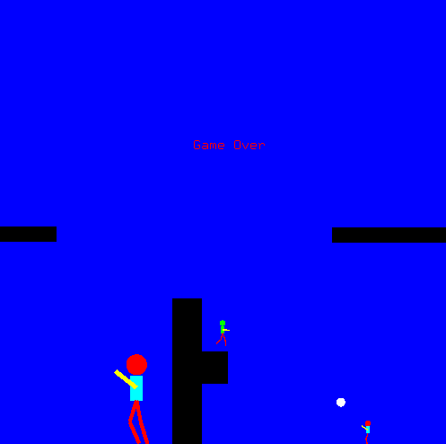

# 2D Side-Scrolling Game in OpenGL

This project is a 2D side-scrolling game implemented in C++ using OpenGL and FreeGLUT.

<div align="center">
  
</div>

## 🕹️ Game Overview

The game is rendered in a lateral view (side-scrolling style), where the player must move from the left to the right side of the arena, avoiding obstacles and enemy attacks.

The main features include:

- Arena and characters loaded from an SVG file
- Player character with articulated body parts (head, torso, legs, and arm)
- Player controls: walk (`A` and `D` keys), jump (right mouse button), and shoot (left mouse button)
- Arm controlled by vertical mouse movement
- Collision detection with obstacles and enemies
- Enemies that move and shoot randomly
- Win/lose condition with restart option (`R` key)
- Dynamic camera that follows the player

## 📁 How to Run

### Dependencies

- OpenGL
- FreeGLUT
- TinyXML (for SVG parsing)

### Build Instructions

Use the provided `Makefile`:

```bash
make all      # To build the project
make clean    # To remove compiled files
```

This will generate an executable named `trabalhocg`.

### Usage

Run the game by providing the path to the SVG file as a command-line argument:

```bash
./trabalhocg path/to/arena.svg
```

## 📐 SVG File Format
The game arena and entities are defined in an SVG file using the following color-coded elements:
- **Blue Rectangle**: Arena boundary
- **Black Rectangles**: Obstacles
- **Green Circle**: Player starting position
- **Red Circles**: Enemy starting positions

The diameter of the circles defines the height of the characters.

## 🎮 Controls

| Action         | Control               |
|----------------|-----------------------|
| Move Left      | `A` key                |
| Move Right     | `D` key                |
| Jump           | Right Mouse Button   |
| Shoot          | Left Mouse Button    |
| Restart Game   | `R` key                |
| Aim Arm        | Vertical Mouse Move  |
